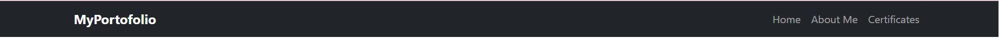
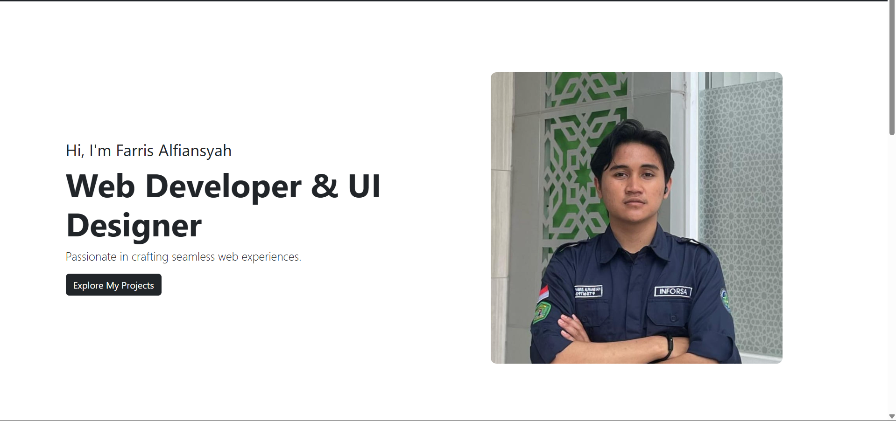

# 📌 Portfolio Website

### Nama: Moch. Farris Alfiansyah
### NIM: 2409116079

## Struktur Section & Penjelasan Code

### 1. Navbar


📌 Fitur:
* Navigasi ke Home, About Me, dan Certificates
* Responsive (menggunakan Bootstrap Navbar)
* Fixed-top agar selalu terlihat saat scroll

⚙️ Implementasi:
* Menggunakan class navbar, navbar-expand-lg, container
* Collapse menu otomatis saat tampilan mobile
* Menggunakan anchor link (#home, #about, #certificates)

💻 Code
```
<nav class="navbar navbar-expand-lg navbar-dark bg-dark fixed-top">
  <div class="container">
    <a class="navbar-brand fw-bold" href="#">MyPortfolio</a>
    <button class="navbar-toggler" type="button" 
            data-bs-toggle="collapse" 
            data-bs-target="#navbarNav">
      <span class="navbar-toggler-icon"></span>
    </button>
    <div class="collapse navbar-collapse" id="navbarNav">
      <ul class="navbar-nav ms-auto">
        <li class="nav-item">
          <a class="nav-link" href="#home">Home</a>
        </li>
        <li class="nav-item">
          <a class="nav-link" href="#about">About Me</a>
        </li>
        <li class="nav-item">
          <a class="nav-link" href="#certificates">Certificates</a>
        </li>
      </ul>
    </div>
  </div>
</nav>
```

### 2. Hero Section




📌 Fungsi:
* Menampilkan nama, profesi, deskripsi singkat, tombol CTA, dan foto profil.

⚙️ Implementasi:
* Menggunakan Grid Bootstrap (row, col-md-6)
* {{ name }} dan {{ title }} berasal dari Vue JS
* :src="profileImage" binding gambar dengan Vue

💻 Code
```
<section id="home" class="vh-100 d-flex align-items-center">
  <div class="container">
    <div class="row align-items-center">

      <div class="col-md-6">
        <h5>Hi, I'm {{ name }}</h5>
        <h1 class="display-4 fw-bold">{{ title }}</h1>
        <p>{{ description }}</p>
        <a href="#about" class="btn btn-dark">Explore My Projects</a>
      </div>

      <div class="col-md-6 text-center">
        
      </div>

    </div>
  </div>
</section>
```

### 3. About Me Section


📌 Fungsi:
* Menampilkan deskripsi lengkap tentang diri.

💻 Code
```
<section id="about" class="py-5 bg-dark text-light">
  <div class="container">
    <div class="row align-items-center">

      <div class="col-md-5">
        
      </div>

      <div class="col-md-7">
        <h2>About Me</h2>
        <p>
          Hello, I'm <strong>{{ name }}</strong>, 
          a <strong>{{ title }}</strong> with 
          <strong>1+ years of experience</strong>.
        </p>
      </div>

    </div>
  </div>
</section>
```

### 4. Skills Section


📌 Fungsi:
* Menampilkan keahlian dengan progress bar.

⚙️ Implementasi:
* v-for digunakan untuk looping data
* Lebar progress bar diatur secara dinamis dari Vue

💻 Code
```
<div class="col-md-6">
  <h4>Skills</h4>

  <div v-for="skill in skills" class="mb-3">
    <div class="d-flex justify-content-between">
      <span>{{ skill.name }}</span>
      <span>{{ skill.level }}%</span>
    </div>

    <div class="progress">
      <div class="progress-bar"
           :style="{ width: skill.level + '%' }">
      </div>
    </div>
  </div>
</div>
```

### 5. Experience Section


📌 Fungsi:
* Menampilkan pengalaman kerja dalam bentuk card.

💻 Code
```
<div class="col-md-6">
  <h4>Experience</h4>

  <div class="card mb-3" 
       v-for="exp in experiences">
    <div class="card-body">
      <h6>{{ exp.year }}</h6>
      <p>{{ exp.role }}</p>
    </div>
  </div>
</div>
```

### 6. Certificates Section


📌 Fungsi:
* Menampilkan 3 sertifikat berbeda dalam bentuk card grid.

💻 Code
```
<section id="certificates" class="py-5">
  <div class="container">
    <h2 class="text-center mb-5">Certificates</h2>

    <div class="row">
      <div class="col-md-4 mb-4" 
           v-for="cert in certificates">

        <div class="card h-100 shadow-lg">
          

          <div class="card-body">
            <h5>{{ cert.title }}</h5>
            <p>{{ cert.description }}</p>
            <button class="btn btn-outline-dark btn-sm">
              View
            </button>
          </div>
        </div>

      </div>
    </div>
  </div>
</section>
```

## ⚙️ Teknologi yang Digunakan

### 1. HTML5
- Digunakan untuk struktur dasar website.

### 2. CSS3
* Custom styling
* Hover effect
* Layout tambahan

### 3. Bootstrap 5
* Navbar
* Grid System
* Card
* Button
* Progress Bar
* Responsive Design

### 4. Vue JS (CDN)
* createApp()
* data()
* {{ interpolation }}
* v-for
* :binding
* .mount('#app')


# Full Page


